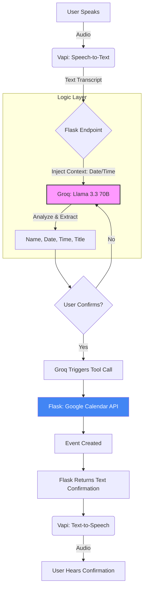

# Voice Scheduling Agent

A real-time voice assistant that schedules Google Calendar events through 
natural conversation. Built with Vapi.ai, Groq (Llama 3.3 70B versatile), Python Flask, and Google Calendar API.

---

## Live Demo

🎙️ **Talk to the agent here:** [https://vapi.ai?demo=true&shareKey=01cea01a-f597-47de-9232-b824ac98dcb0&assistantId=87534500-9dd0-4ed4-a0be-caadd6cdf34e]

📅 **View created events here:** [https://calendar.google.com/calendar/embed?src=0ab3d09a46bd9fb7d06a1c62f45cc87625a23f3b7a7e68005104b5e835000891%40group.calendar.google.com&ctz=UTC]

---

## Demo Video

[https://www.loom.com/share/178a8dfbc55644098b9f52d4c7d72514]

---

## How to Test the Agent

1. Open the agent link above
2. Click the **microphone button** and allow microphone access
3. Have a natural conversation with Alex:
```
Alex: "Hi! I'm Tara, your scheduling assistant. Could I get your name?"
You:  "John Smith"

Alex: "What date works for you?"
You:  "Next Monday" or "February 25th"

Alex: "What time? I save times in UTC."
You:  "2pm"

Alex: "Do you have a title for this meeting?"
You:  "Project Kickoff" (or say "no" to skip)

Alex: "Just to confirm — I'll book 'Project Kickoff' for John Smith 
       on Monday February 23rd 2026 at 2:00 PM UTC. Does that sound right?"
You:  "Yes"

Alex: "Done! Your event is booked. Have a great day!"
```

4. Open the **public calendar link** above and refresh — the event appears instantly ✅

> All times are in UTC. The public calendar is also set to UTC for consistency.

---

## Architecture


---


## Calendar Integration

The agent uses **Google Calendar API** with **OAuth 2.0** authentication.

**How it works:**
- Events are created in a dedicated calendar called "Voice Agent Bookings"
- This calendar is separate from personal events and made publicly visible
- Authentication uses a long-lived OAuth refresh token stored as an environment variable
- When the user confirms their booking, Groq triggers the createCalendarEvent tool
- Flask /chat/completions endpoint detects the tool call and creates the calendar event directly
- The event appears in the public calendar instantly

**Why a separate calendar:**
- Keeps personal events private
- Can verify event creation in real time without needing Google account access

**Endpoints:**
- `GET /` — Health check
- `POST /chat/completion` — Custom LLM endpoint. Receives conversation from Vapi, injects today's date into system prompt, forwards to Groq, returns response and after getting all required details, creates the Google Calendar event directly.

**Why Tool Calls Are Handled Inside /chat/completions:**
Vapi's Custom LLM provider does not automatically forward tool calls from the LLM response to external server URLs. To work around this, when Groq decides to call createCalendarEvent, the Flask backend detects the tool call inside /chat/completions, creates the calendar event directly, and returns the confirmation as a plain text response that Vapi speaks to the user.

**Why Custom LLM endpoint instead of direct Groq integration:**
Vapi supports Groq natively but using a custom LLM endpoint lets us inject today's date dynamically into the system prompt on every request. This allows the agent to correctly resolve relative dates like "next Monday" or "this Thursday" regardless of when the agent is used and also allows false events from being made such as user giving date/time from last week or month etc.

---

## Tech Stack

| Tool | Purpose |
|---|---|
| Vapi.ai | Voice layer — speech-to-text, text-to-speech, conversation hosting |
| Groq (Llama 3.3 70B versatile) | LLM — conversation understanding |
| Python Flask | Backend — custom LLM endpoint + calendar integration |
| Google Calendar API | Creates real calendar events |
| Railway | Backend hosting — always-on, no cold starts |

---

## Prerequisites
- Python 3.8+
- Git
- A Google Cloud project with Calendar API enabled
- Groq API key
- Vapi account

---

## Environment Variables

| Variable | Description |
|---|---|
| `GROQ_API_KEY` | Groq API key for LLM inference |
| `GOOGLE_CLIENT_ID` | Google OAuth 2.0 Client ID |
| `GOOGLE_CLIENT_SECRET` | Google OAuth 2.0 Client Secret |
| `GOOGLE_REFRESH_TOKEN` | OAuth refresh token for calendar access |
| `CALENDAR_ID` | Google Calendar ID for event creation |