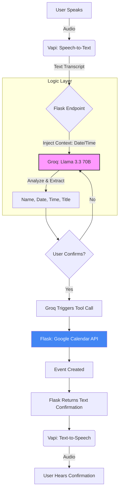

# Voice Scheduling Agent

A real-time voice assistant that schedules Google Calendar events through 
natural conversation. Built with Vapi.ai, Groq (Llama 3.3 70B versatile), Python Flask, and Google Calendar API.

---

## Architecture

---

## Tech Stack

| Tool | Purpose |
|---|---|
| Vapi.ai | Voice layer — speech-to-text, text-to-speech, conversation hosting |
| Groq (Llama 3.3 70B versatile) | LLM — conversation understanding |
| Python Flask | Backend — custom LLM endpoint + calendar integration |
| Google Calendar API | Creates real calendar events |
| Railway | Backend hosting — always-on, no cold starts |

---

## Prerequisites
- Python 3.8+
- Git
- A Google Cloud project with Calendar API enabled
- Groq API key
- Vapi account

---

## Environment Variables

| Variable | Description |
|---|---|
| `GROQ_API_KEY` | Groq API key for LLM inference |
| `GOOGLE_CLIENT_ID` | Google OAuth 2.0 Client ID |
| `GOOGLE_CLIENT_SECRET` | Google OAuth 2.0 Client Secret |
| `GOOGLE_REFRESH_TOKEN` | OAuth refresh token for calendar access |
| `CALENDAR_ID` | Google Calendar ID for event creation |